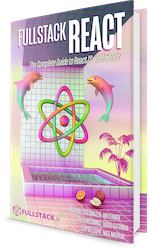

<hr />
<h1 align="center">
  FrontEnd Developer | ReactJS Basic Course
</h1>
<p align="center">


</p>

<h2 align="center">

An Introduction to React

</h2>
<hr />

# Introduction

In this course, we will walk through everything you need to know to develop applications with React. From the beginner through testing and deployment of our first app.
This repository contains the source code and extra content for the course. Course literature is available through ordinary channels.

## Parts in the course

<!-- prettier-ignore -->
| <a href='./part-01'></a><h4 align='center'><a href='./part-01'>What is React?</a><h4> | <a href='./part-02'></a><h4 align='center'><a href='./part-02'>What is JSX?</a><h4> | <a href='./part-03'></a><h4 align='center'><a href='./part-03'>Our First Components</a><h4> | <a href='./part-04'></a><h4 align='center'><a href='./part-04'>Complex Components</a><h4> | <a href='./part-05'></a><h4 align='center'><a href='./part-05'>Data-Driven</a><h4> |
| :---: | :---: | :---: | :---: | :---: |
| <a href='./part-06'></a><h4 align='center'><a href='./part-06'>State</a><h4> | <a href='./part-07'></a><h4 align='center'><a href='./part-07'>Lifecycle Hooks</a><h4> | <a href='./part-08'></a><h4 align='center'><a href='./part-08'>Packaging and PropTypes</a><h4> | <a href='./part-09'></a><h4 align='center'><a href='./part-09'>Styles</a><h4> | <a href='./part-10'></a><h4 align='center'><a href='./part-10'>Interactivity</a><h4> |
| <a href='./part-11'></a><h4 align='center'><a href='./part-11'>Pure Components</a><h4> | <a href='./part-12'></a><h4 align='center'><a href='./part-12'>create-react-app</a><h4> | <a href='./part-13'></a><h4 align='center'><a href='./part-13'>Repeating Elements</a><h4> | <a href='./part-14'></a><h4 align='center'><a href='./part-14'>Fetching Remote Data</a><h4> | <a href='./part-15'></a><h4 align='center'><a href='./part-15'>Introduction to Promises</a><h4> |
| <a href='./part-16'></a><h4 align='center'><a href='./part-16'>Displaying Remote Data</a><h4> | <a href='./part-17'></a><h4 align='center'><a href='./part-17'>Client-side Routing</a><h4> | <a href='./part-18'></a><h4 align='center'><a href='./part-18'>Introduction to Flux</a><h4> | <a href='./part-19'></a><h4 align='center'><a href='./part-19'>Data Management with Redux</a><h4> | <a href='./part-20'></a><h4 align='center'><a href='./part-20'>Redux actions</a><h4> |
| <a href='./part-21'></a><h4 align='center'><a href='./part-21'>Redux Middleware</a><h4> | <a href='./part-22'></a><h4 align='center'><a href='./part-22'>Introduction to Testing</a><h4> | <a href='./part-23'></a><h4 align='center'><a href='./part-23'>Implementing Tests</a><h4> | <a href='./part-24'></a><h4 align='center'><a href='./part-24'>Testing the App</a><h4> | <a href='./part-25'></a><h4 align='center'><a href='./part-25'>Better Testing with Enzyme</a><h4> |
| <a href='./part-26'></a><h4 align='center'><a href='./part-26'>Integration Testing</a><h4> | <a href='./part-27'></a><h4 align='center'><a href='./part-27'>Deployment Introduction</a><h4> | <a href='./part-28'></a><h4 align='center'><a href='./part-28'>Deployment</a><h4> | <a href='./part-29'></a><h4 align='center'><a href='./part-29'>Continuous Integration</a><h4> | <a href='./part-30'></a><h4 align='center'><a href='./part-30'>Wrap-up and More Resources</a><h4> |

## 👩‍🏫 How to use this repository

Each part contains a full React application, following the same procedure used to create the course. Most parts can be run using the same basic steps (and for the part that require a bit more work, please attend our live workshops).

The steps to install and run any of the course projects is as follows:

```bash
# install the dependencies
yarn install

# start the project
yarn start
```

or with Node Package Manager

```bash
# install the dependencies
npm install

# start the project
npm start
```

Since all of the days are built using the fantastic [create-react-app](https://github.com/facebookincubator/create-react-app) tool, all of the commands are available from that project in every day.

---

# Fullstack React Book

<a href="https://fullstackreact.com">

</a>

This ReactJS course was written and developed based on the [Fullstack React](https://fullstackreact.com) book. In the book they cover many more projects similar to ours. The book will walk through each line of code, explain why it's there and how it works.

<div style="clear:both"></div>
